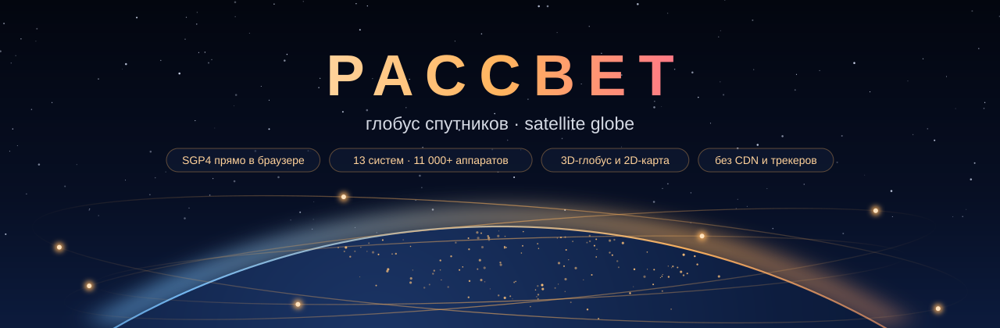
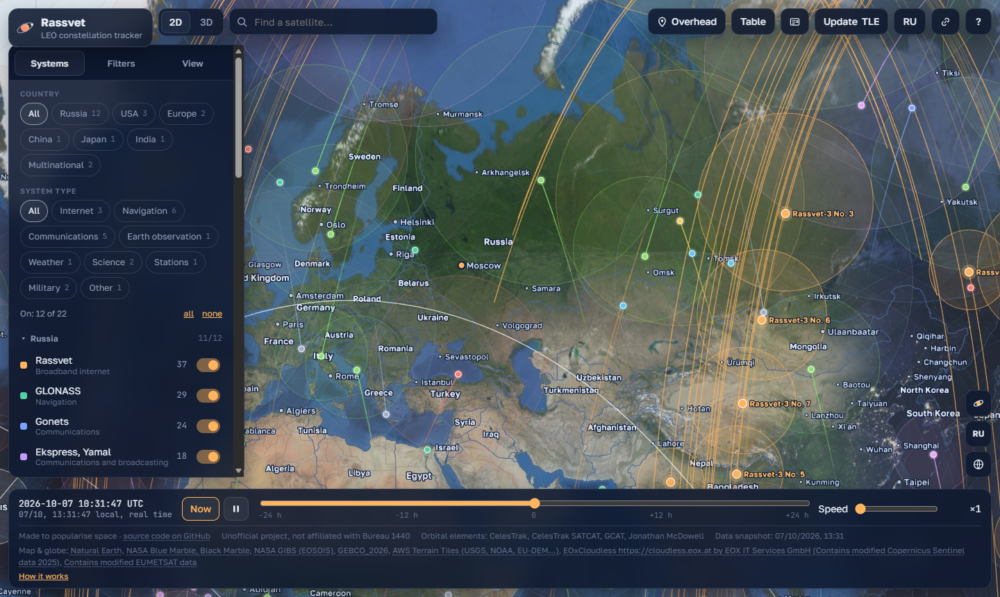
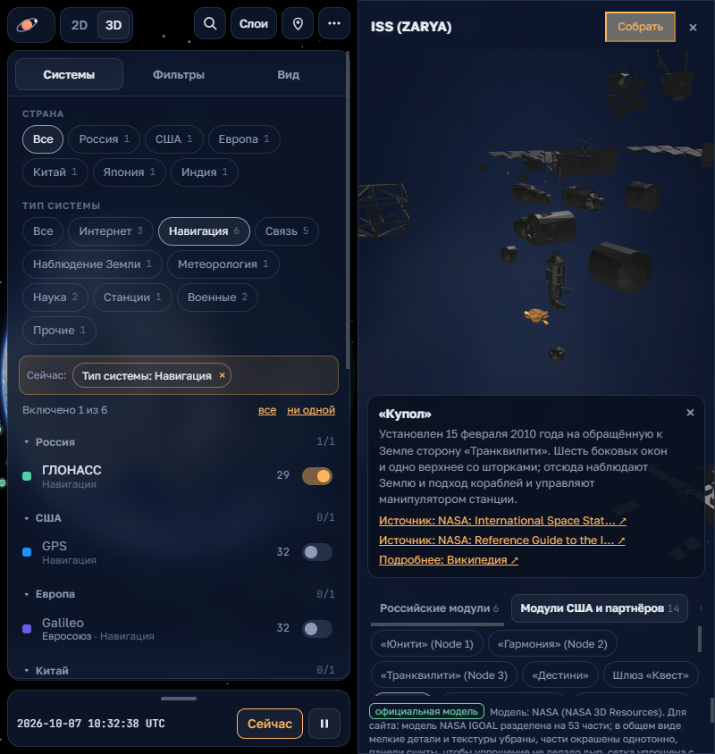
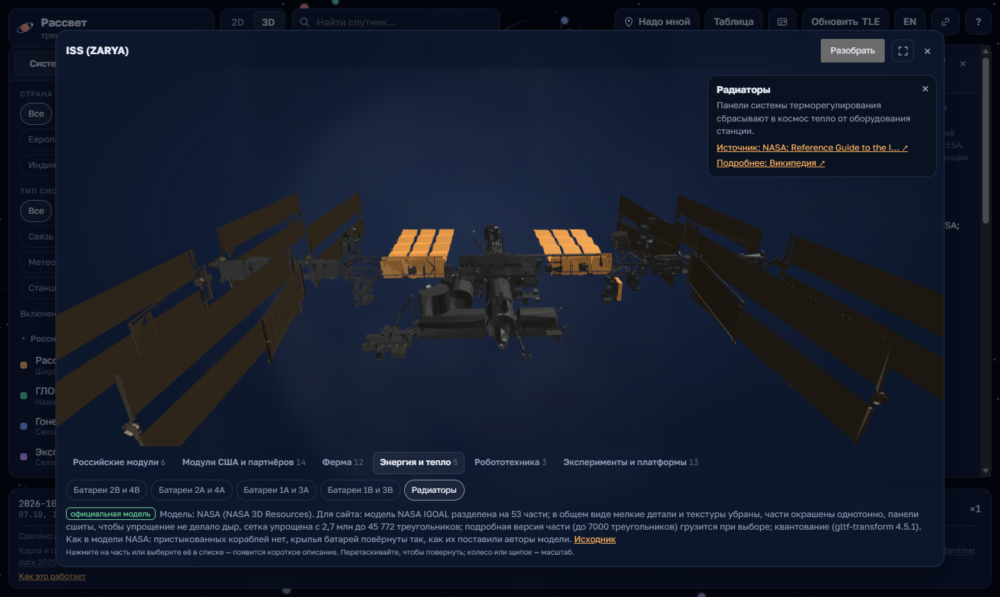
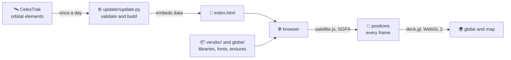

<p align="center">
  
</p>

<p align="center">
  <a href="README.md">Русский</a> · <b>English</b>
</p>

<p align="center">
  <a href="#-run-in-a-minute">Run in a minute</a> ·
  <a href="#-how-it-works">How it works</a> ·
  <a href="#-your-own-server-from-scratch">Own server</a> ·
  <a href="#-installing-on-popular-platforms">Platforms</a> ·
  <a href="#-whats-in-the-repository">Files</a> ·
  <a href="#-data-sources">Sources</a> ·
  <a href="#-faq">FAQ</a> ·
  <a href="CHANGELOG.md">Changes</a>
</p>

---

**Rassvet Satellite Globe** is a popular-science tracker in the browser. A photorealistic Earth with
its night side and city lights, surrounded by satellites in real time: the Russian low-Earth-orbit
constellation Rassvet (Bureau 1440), GLONASS, Gonets, Express and Yamal, Luch, Meridian, weather and
science satellites, Earth-observation satellites; the GPS, Galileo, BeiDou, QZSS and NavIC navigation
systems; the ISS and the China Space Station; science satellites, Starlink, OneWeb and Iridium.

The project is non-commercial and made to popularise space: anyone can open the page, see what is flying
overhead right now and work out how it all works — no sign-up, nothing to install.

Positions are computed right in the browser with the SGP4 model — no computing server, no analytics,
no CDN. An orbit snapshot is embedded in the page, so the site works right after `git clone`.

> [!NOTE]
> Unofficial project, not affiliated with Bureau 1440. Rassvet details are collected from public
> sources; every fact links to its source in the satellite card.

<p align="center">
  
</p>

<table>
  <tr>
    <td width="38%"></td>
    <td width="62%"></td>
  </tr>
  <tr>
    <td align="center"><sub>Phone: systems by country and type, the ISS part by part</sub></td>
    <td align="center"><sub>NASA 3D model: the ISS in 53 parts in six groups, each with a description and sources</sub></td>
  </tr>
</table>

## 🔢 By the numbers

| | |
|---|---|
| 🛰 Systems on the map | **22** from 7 countries and regions, 9 types: internet, navigation, communications, Earth observation and more |
| 📡 Satellites in the snapshot | **≈ 12,360**, of which Starlink ≈ 11,070, OneWeb 651 and Rassvet 38 |
| 🌍 Map | 242 countries, 4,583 regions, 7,342 cities in Russian and English |
| 🖼 Earth textures | 3 levels of detail, up to 4096 × 2048, ≈ 8 MB |
| ⚙️ Build step | none: one HTML file, three libraries and fonts in `vendor/` |
| 🔒 External requests by the page | **0** — everything is served by your own site |

## ✨ Features

**Globe and map**
- 3D globe with NASA Blue Marble imagery, GEBCO relief, atmosphere, clouds and the night side for the
  current moment; city lights switch on as the Sun sets below the horizon. Clouds fade out as you zoom in
  and can be turned off in the layers.
- Close-up view: Sentinel-2 imagery on relief; while detailed tiles load, a layer of coarser tiles covers
  the area, and relief is built in background threads.
- 2D equirectangular map, one-click switch; the current view is kept in a shareable link.

**Satellites**
- Layers: ±½-orbit ground tracks, non-overlapping labels, motion trails, coverage zones with an
  adjustable minimum elevation above the horizon.
- Colouring by system, launch or satellite; Starlink is shaded by generation.
- A panel with three tabs — Systems, Filters, View — instead of one long list; on a phone it opens with
  the Layers button.
- Browse systems by country (Russia, USA, Europe, China, Japan, India, multinational) and type (internet,
  navigation, communications, Earth observation, weather, science, stations, military). Systems are
  grouped by country and each shows whose it is: GPS — USA, Galileo — European Union, BeiDou — China.
  Options wrap onto new lines so all are visible; a summary on top lists the active filters, each removable
  with a cross.
- Filters on top of systems: orbit type (low, medium, geosynchronous, highly elliptical), owner per the
  SATCAT catalogue and launch year; each option shows how many satellites remain.
- Satellite card: status (marked "unconfirmed" when sources disagree), generation, launch, NORAD and
  COSPAR IDs, altitude, speed, sub-satellite point, sunlit or in shadow, perigee and apogee.

**Time and observing**
- ±24-hour time scale with speed-up: scroll ahead to see where a satellite will be tonight.
- "How it works": orbital elements, the SGP4 model, inclination, orbit types, the ground track, the coverage
  zone and when a satellite is visible to the eye — in plain words, in Russian and English.
- A 3D model of the selected satellite behind the cube button (the window adapts to the screen and has a
  full-screen mode): rotate it, take it apart, tap a part for a
  short description with links to the primary source (NASA, ESA) and to Wikipedia.
  - The ISS — NASA's official model (IGOAL lab) split into 53 parts in six groups: Russian modules, US and
    partner modules, truss segments, arrays and radiators, robotics, external experiments (NICER, GEDI,
    ECOSTRESS, OCO-3, CALET, MAXI, ASIM and more). Each part has dates and purpose per NASA, JAXA and
    ESA; the selected part loads in more detail.
  - Terra, Swift, OCO-2, Hinode and the four MMS spacecraft — official NASA models split into parts by the
    original's materials (body, solar arrays, antenna, telescopes, radiator).
  - Hubble — NASA's official model with markers: the front of the tube, the primary mirror, the solar
    arrays and the instrument section (the NASA file is one piece, so parts are marked, not split).
  - Other satellites — a schematic by platform type labelled "schematic": sizes are approximate, part
    descriptions are generic.
- "Where this data comes from": source and epoch of the orbital elements with a freshness rating, the
  catalogue download date, when the system description was checked against primary sources; military
  satellites are flagged as classified by GCAT and not officially confirmed.
- The next three passes of any selected satellite right in its card, with a calendar file and a
  reminder 5 minutes before.
- "Overhead": what is above your horizon right now and the next Rassvet passes, flagged when visible
  to the naked eye. Geolocation stays in the browser and is never sent anywhere.

**Convenience**
- Sortable table of all satellites, search by name, NORAD or COSPAR.
- Load your own TLE manually with the "Update TLE" button.
- Russian and English UI, an "i" hint next to every setting, a short tour on first visit.
- Installs on a phone as an app (PWA) and opens offline with the latest data.

## 🚀 Run in a minute

Any static web server will do. The simplest is Python 3:

```bash
git clone https://github.com/AndrewNonsence/rassvet-globe.git
cd rassvet-globe
python -m http.server 8000
```

Open <http://localhost:8000/>. Switch the language with the RU/EN button or a URL parameter:
<http://localhost:8000/?lang=ru>.

> [!TIP]
> Serve the page over HTTP instead of double-clicking the file: at a `file://` address the browser
> refuses to load textures and libraries.

**Browser:** WebGL 2 is required — Chrome, Edge, Firefox and Safari 15+ on desktop and mobile all work.
On a weak GPU the page switches to a lighter globe mode by itself.

## 🔭 How it works



1. **Data.** Once a day `updater/update.py` fetches fresh orbital elements from CelesTrak, drops
   broken and stale ones and writes them into data blocks inside `index.html`. It assembles the line-up
   of GPS, Galileo, BeiDou, QZSS, NavIC, the stations, science satellites, OneWeb and Iridium from SATCAT
   catalogue groups, so new satellites appear by themselves.
2. **Page.** `index.html` is a single file: markup, styles, tracker code and the data itself in
   `<script type="application/json">` blocks. The server computes nothing; it only serves files.
3. **Propagation.** In the browser, [satellite.js](https://github.com/shashwatak/satellite-js) turns
   orbital elements into coordinates for any moment with SGP4. Thousands of satellites are computed in a
   background thread (Web Worker); between its answers the main thread smoothly extends their motion and only draws.
4. **Rendering.** [deck.gl](https://deck.gl/) draws the globe and the map with WebGL 2; Earth lighting,
   the night side, clouds and the atmosphere are the tracker's own shaders.

## 🖥 Your own server from scratch

The site is static, so it can live anywhere — even on GitHub Pages. To have the orbits refresh daily by
themselves you need a small server: a web server serves the files and a timer runs the update script
once a day.

### Requirements

| | Minimum | Notes |
|---|---|---|
| 💻 Server | 1 vCPU, **512 MB** RAM | serving static files is nearly free; the daily update takes up to ≈ 150 MB for 10–60 seconds |
| 💾 Disk | ≈ **200 MB** | clone ≈ 20 MB, Python venv ≈ 30 MB, built page and clouds ≈ 15 MB, logs |
| 🐧 OS | Ubuntu 24.04 LTS or Debian 13 | any Linux with systemd and Python ≥ 3.10 works |
| 🌐 Network | ports **80** and **443** open | outbound HTTPS to `celestrak.org` (and to news feeds and the cloud map if enabled) |
| 🏷 Domain | A/AAAA record pointing to the server | `example.org` in the examples below |
| 🧰 Software | `git`, `python3-venv`, `sudo`, [Caddy](https://caddyserver.com/) 2.6+ | Caddy obtains and renews the HTTPS certificate by itself |

All commands below run as root (or with `sudo`). Directory layout:

```
/var/lib/rassvet-globe/
├── repo/    repository clone: page template, libraries, textures, scripts
├── www/     built page and daily data — written by the update script
├── state/   source cache, updater.log
└── venv/    Python virtual environment for the script
```

### 1. Packages

```bash
apt update && apt install -y git python3-venv caddy sudo
```

<details>
<summary>Your distribution has no <code>caddy</code> package</summary>

Install Caddy following the [official instructions](https://caddyserver.com/docs/install) — there is an
apt repository for Debian and Ubuntu.
</details>

### 2. User and code

The script runs as a dedicated user that cannot log in:

```bash
useradd --system --no-create-home --home-dir /var/lib/rassvet-globe --shell /usr/sbin/nologin globe
install -d -m 0755 -o globe -g globe /var/lib/rassvet-globe
cd /var/lib/rassvet-globe
sudo -u globe git clone https://github.com/AndrewNonsence/rassvet-globe.git repo
sudo -u globe python3 -m venv venv
sudo -u globe venv/bin/pip install --require-hashes -r repo/updater/requirements.lock
```

`requirements.lock` pins exact package versions and hashes: pip refuses to install anything else.

### 3. First page build

```bash
sudo -u globe venv/bin/python repo/updater/update.py --once \
    --template repo/index.html --static repo --out www --data state
```

`www/` now holds `index.html`, its compressed copy, the `data-starlink.<hash>.json` and `geo-detail.<hash>.json`
files and, if enabled, clouds in `clouds/`. The script never modifies the template `repo/index.html`, so `git pull` later runs
without conflicts.

### 4. Caddy

Replace `/etc/caddy/Caddyfile` with the following, using your domain:

```caddyfile
example.org {
	encode zstd gzip

	# never expose the clone's internals
	@private path /.* /updater/* /scripts/* /docs/*
	handle @private {
		respond 404
	}

	# the page and daily data come from the directory the update script writes
	@daily path / /index.html /data-starlink.* /geo-detail.* /clouds/*
	handle @daily {
		root * /var/lib/rassvet-globe/www
		file_server {
			precompressed gzip
		}
	}

	# libraries, textures and icons come straight from the clone
	handle {
		root * /var/lib/rassvet-globe/repo
		file_server
	}

	# files with a version or hash in the name never change — let browsers keep them
	@immutable path /vendor/* /globe/*.webp /globe/*.jpg /data-starlink.* /geo-detail.*
	header @immutable Cache-Control "public, max-age=31536000, immutable"
	@revalidate path / /index.html /sw.js /manifest.webmanifest /globe/globe.json /clouds/*
	header @revalidate Cache-Control "no-cache"
}
```

```bash
systemctl reload caddy
```

A few seconds later the site opens at `https://example.org/` — Caddy gets the certificate itself.

### 5. Daily update

A service that runs the script once — `/etc/systemd/system/rassvet-globe-update.service`:

```ini
[Unit]
Description=Rassvet globe: orbit update
Wants=network-online.target
After=network-online.target

[Service]
Type=oneshot
User=globe
WorkingDirectory=/var/lib/rassvet-globe
ExecStart=/var/lib/rassvet-globe/venv/bin/python repo/updater/update.py --once --template repo/index.html --static repo --out www --data state
NoNewPrivileges=yes
ProtectSystem=strict
ProtectHome=yes
PrivateTmp=yes
ReadWritePaths=/var/lib/rassvet-globe/www /var/lib/rassvet-globe/state
```

And its timer — `/etc/systemd/system/rassvet-globe-update.timer`:

```ini
[Unit]
Description=Rassvet globe: daily orbit update

[Timer]
OnCalendar=*-*-* 03:30:00 UTC
RandomizedDelaySec=20m
Persistent=true

[Install]
WantedBy=timers.target
```

```bash
systemctl daemon-reload
systemctl enable --now rassvet-globe-update.timer
```

> [!IMPORTANT]
> CelesTrak serves the same dataset at most once every two hours and answers frequent requests with
> HTTP 403. Once a day leaves plenty of margin. If a download fails, the script falls back to the last
> good copy in `state/` and keeps the site on its previous version.

### 6. Check

```bash
systemctl list-timers rassvet-globe-update.timer
journalctl -u rassvet-globe-update.service -n 30
```

The log should end with a "published" line (`Опубликовано: блоков обновлено …` — the script logs in
Russian). The snapshot date is also shown in the page footer.

### Updating the code

```bash
cd /var/lib/rassvet-globe
sudo -u globe git -C repo pull --ff-only
sudo -u globe venv/bin/pip install --require-hashes -r repo/updater/requirements.lock
systemctl start rassvet-globe-update.service
```

### Update script settings

Set them as environment variables — in the service, with `Environment=` lines:

| Variable | Default | What it does |
|---|---|---|
| `MAX_EPOCH_AGE_DAYS` | `30` | orbital elements older than this many days are rejected |
| `SPACETRACK_USER`, `SPACETRACK_PASS` | — | a [Space-Track](https://www.space-track.org/) account as a second source for Rassvet; skipped without it |
| `UPDATE_HOUR_UTC` | `3` | update hour in `--loop` mode (not needed with the systemd timer) |

Sources are listed in `updater/sources.yml`. The `news` section (a space-news feed from RSS) and the
`clouds` section (a daily cloud map) are optional: remove them and the script contacts CelesTrak only.

### No server: GitHub Pages

Fork the repository and enable **Pages → Deploy from a branch → main / (root)** in its settings — a
minute later the site opens at an address like `https://<user>.github.io/rassvet-globe/`. Two limits:

- the orbits stay at the snapshot date in the repository — refresh them locally with the command from
  the next section and commit `index.html` together with the `data-starlink.*.json` and `geo-detail.*.json` files;
- the site lives in a subfolder while the service worker and manifest expect the site root, so offline
  mode and installing as an app are limited. A custom domain in the Pages settings removes this.

## 🧭 Installing on popular platforms

| Platform | How | Orbits refresh by themselves | HTTPS and offline mode |
|---|---|---|---|
| 🐧 VPS with Ubuntu or Debian | [Caddy and a systemd timer](#-your-own-server-from-scratch) | yes | yes |
| 🟧 Proxmox VE | a light LXC container running the same guide | yes | yes with a domain; HTTP on a home network |
| 🐳 Docker: Linux, NAS, Docker Desktop | a Caddy container and a one-shot Python container | yes, via cron | yes with a domain |
| 🍓 Raspberry Pi | Raspberry Pi OS is Debian — the server guide applies | yes | yes |
| 🪟 Windows | Python or Caddy from winget | manually | on `localhost` |
| 🍎 macOS | Python or Caddy from Homebrew | manually | on `localhost` |
| ☁️ GitHub Pages, Netlify, Cloudflare Pages | upload the files as they are | no, the repository snapshot | yes |

### 🟧 Proxmox VE

An unprivileged LXC container is enough — no virtual machine needed. On the Proxmox host
(web UI → node → **Shell**):

```bash
# a fresh Debian template: 13 if your Proxmox version has it, otherwise 12
pveam update
T=$(pveam available --section system | awk '/debian-1[23]-standard/ {print $2}' | sort -V | tail -1)
pveam download local "$T"

# container: 1 core, 512 MB RAM, 4 GB disk, DHCP address, starts with the host
pct create 210 "local:vztmpl/$T" \
    --hostname rassvet-globe --cores 1 --memory 512 --swap 512 \
    --rootfs local-lvm:4 --net0 name=eth0,bridge=vmbr0,ip=dhcp \
    --unprivileged 1 --features nesting=1 --onboot 1
pct start 210
pct enter 210
```

- `210` is any free container ID; `local-lvm` is the disk storage (usually `local-zfs` on ZFS),
  `vmbr0` is the network bridge.
- `nesting=1` lets systemd of recent Debian releases work properly inside the container.

Inside the container you are root. Continue with steps 1–6 of
["Your own server from scratch"](#-your-own-server-from-scratch). Debian 12 has no `caddy` package in its
standard repositories — install it via the link in step 1.

Opening the site:
- **From the internet, with a domain.** Forward ports 80 and 443 on your router to the container address
  (`ip -4 addr show eth0` inside it) — the rest is as in the guide, Caddy gets HTTPS by itself.
- **Home network only.** Write `:80` instead of `example.org` in the Caddyfile — the site opens at
  `http://<container address>/`. The globe and the map work fully, but without HTTPS browsers do not
  enable the service worker: no offline mode and no installing as an app.

### 🐳 Docker

Works on a Linux server, a NAS with Docker support or Docker Desktop. On Windows run the commands
below in a WSL terminal.

```bash
mkdir rassvet-globe && cd rassvet-globe
git clone https://github.com/AndrewNonsence/rassvet-globe.git repo
mkdir www state
```

Next to it create a `Caddyfile` — the same two-directory setup as on the server:

```caddyfile
:80 {
	encode zstd gzip

	@private path /.* /updater/* /scripts/* /docs/*
	handle @private {
		respond 404
	}

	@daily path / /index.html /data-starlink.* /geo-detail.* /clouds/*
	handle @daily {
		root * /srv/www
		file_server {
			precompressed gzip
		}
	}

	handle {
		root * /srv/repo
		file_server
	}
}
```

Put the update into `update.sh`; it starts a clean Python container every time:

```bash
cat > update.sh <<'SH'
#!/bin/sh
cd "$(dirname "$0")"
docker run --rm -v "$PWD/repo:/repo:ro" -v "$PWD/www:/www" -v "$PWD/state:/state" python:3.12-slim \
    sh -c "pip install -q --root-user-action=ignore --require-hashes -r /repo/updater/requirements.lock \
           && python /repo/updater/update.py --once --template /repo/index.html --static /repo --out /www --data /state"
SH
chmod +x update.sh && ./update.sh
```

Start the site:

```bash
docker run -d --name rassvet-globe --restart unless-stopped -p 8080:80 \
    -v "$PWD/Caddyfile:/etc/caddy/Caddyfile:ro" \
    -v "$PWD/repo:/srv/repo:ro" -v "$PWD/www:/srv/www:ro" \
    caddy:2
```

The site opens at <http://localhost:8080/>. For a daily refresh add a line with the full folder path
via `crontab -e`:

```
30 3 * * * /full/path/rassvet-globe/update.sh >/dev/null 2>&1
```

> [!TIP]
> For HTTPS with a domain replace `:80` with `example.org` in the Caddyfile, and `-p 8080:80` with
> `-p 80:80 -p 443:443 -v caddy_data:/data` in `docker run`: Caddy keeps its certificate in the
> `caddy_data` volume.

### 🍓 Raspberry Pi

Raspberry Pi 3, 4, 5 and Zero 2 W with 64-bit Raspberry Pi OS will do. It is Debian, so follow
["Your own server from scratch"](#-your-own-server-from-scratch): Caddy installs via the link in step 1,
and sgp4 and PyYAML have ready-made ARM64 builds, no compiler needed. Open the globe from a computer or
phone: the browser on the Pi itself may lack GPU power.

### 🪟 Windows

To look locally, install Git and Python — `winget install Git.Git`, then
`winget install Python.Python.3.12` — and in a new PowerShell window:

```powershell
git clone https://github.com/AndrewNonsence/rassvet-globe.git
cd rassvet-globe
py -m http.server 8000
```

Caddy works instead of Python too: `winget install CaddyServer.Caddy`, then
`caddy file-server --listen :8000` in the repository folder.

Refresh orbits:

```powershell
py -m venv .venv
.venv\Scripts\pip install --require-hashes -r updater\requirements.lock
.venv\Scripts\python updater\update.py --once --template index.html --static . --out . --data .cache
```

For a permanent site on Windows, [Docker](#-docker) via Docker Desktop or WSL with Ubuntu and the server
guide is more convenient.

### 🍎 macOS

With [Homebrew](https://brew.sh/):

```bash
brew install git python caddy
git clone https://github.com/AndrewNonsence/rassvet-globe.git
cd rassvet-globe
python3 -m http.server 8000          # or: caddy file-server --listen :8000
```

Refresh orbits with the commands from ["Refresh orbits locally"](#-refresh-orbits-locally)
(using `python3` instead of `python`).

### ☁️ Static hosting

The site works on any static host with no build step. Orbits stay at the repository snapshot date —
refresh them locally and upload again.

- **GitHub Pages** — see [above](#no-server-github-pages).
- **Netlify** — manual deploy (*Deploy manually*): drag in the repository folder without `.git`.
- **Cloudflare Pages** — a project with direct file upload (*Upload assets*), the same folder. The
  largest file, `index.html`, is ≈ 4.8 MB — within the 25 MB per-file limit.

## 🔄 Refresh orbits locally

```bash
python -m venv .venv
.venv/bin/pip install --require-hashes -r updater/requirements.lock      # Windows: .venv\Scripts\pip
.venv/bin/python updater/update.py --once --template index.html --static . --out . --data .cache
```

This updates the page in place: `index.html` is rewritten, the Starlink and the regions-and-cities blocks move
into `data-starlink.<hash>.json` and `geo-detail.<hash>.json` files next to it, cache and logs go to `.cache/`. To preview first, use
`--dry-run` instead of `--once`: the built page lands in `.cache/state/dry-run/` and your files stay
untouched.

> [!NOTE]
> For repeated in-place updates start from a clean file: `git checkout -- index.html`, then the command
> above. Otherwise the script uses the already updated page as its template.

## 🎨 Rebuild globe textures

Ready-made textures are already in `globe/`; rebuild them only when changing sources or encoding. You
need ≈ 5 GB of disk (sources download with resume) and the `cwebp` tool (the `webp` package):

```bash
.venv/bin/pip install --require-hashes -r scripts/globe/requirements.lock
.venv/bin/python scripts/globe/build_globe.py --src .cache/globe-src --out globe
```

## 📂 What's in the repository

```
rassvet-globe/
├── index.html                ← the whole page: code, styles and embedded data
├── sw.js                     ← offline mode
├── manifest.webmanifest      ← install as an app
├── earth-day.jpg             ← daytime Earth for the 2D map
├── earth-night.jpg           ← city lights for the 2D map
├── favicon.ico, apple-touch-icon.png, icon-*.png
├── globe/                    ← 3D globe textures and their manifest
├── models/                   ← official NASA 3D models: the ISS in parts, Hubble, Terra, Swift and more
├── vendor/                   ← deck.gl, satellite.js, topojson-client, fonts
├── updater/                  ← daily orbit update script
├── scripts/globe/            ← builds globe textures from the sources
├── scripts/catalog/          ← catalogue and model checks
├── scripts/models/           ← 3D model preparation (gltf-transform)
└── docs/                     ← banner and screenshots for this README
```

### 📄 The page

**`index.html`** (≈ 4.8 MB) is the application itself. Code takes ≈ 270 KB and ≈ 3,400 lines: the UI,
position propagation, deck.gl layers, Earth and atmosphere shaders, translations into two languages.
The remaining ≈ 4.6 MB is data in 28 `<script type="application/json">` blocks:

| Block | Contents |
|---|---|
| `registry` | registry of 22 systems: names, colours, group, and the rules that assign a satellite from the general catalogue to a system |
| `data-rassvet` | everything about Rassvet: 38 satellites with orbital elements, 3 generations, 4 launches, plans up to 2030 and 34 sources — every fact marked "confirmed" or "unconfirmed" |
| `data-glonass` … `data-ru-other` | 11 Russian systems, one row per satellite: NORAD, name, COSPAR, launch date, GCAT program and category, subtype, SATCAT perigee, apogee and inclination, orbital elements and their epoch |
| `data-gps` … `data-iridium` | 9 systems whose line-up is assembled from CelesTrak SATCAT groups, same row format plus the SATCAT owner |
| `data-starlink` | ≈ 11,070 Starlink satellites (≈ 2.7 MB) — loaded after the first frame so the page opens fast |
| `geo-data` | Natural Earth (≈ 360 KB): 242 countries — coastlines, borders and labels needed for the first frame |
| `geo-detail` | Natural Earth (≈ 1.3 MB): region borders, 4,583 regions and 7,342 cities labelled in Russian and English — loaded after the first frame |
| `data-meta` | snapshot date and the list of sources it was built from |
| `data-history`, `data-news` | orbit altitude history and the news feed — filled by the update script |

**`sw.js`** is the service worker. It fetches the page from the network first and falls back to the
saved copy offline. Libraries, textures and data files with a hash in the name are cached forever (they
never change); close-up tiles are left to the browser's regular HTTP cache. When the caching strategy
changes, the version number
in the file is bumped and old caches are removed automatically.

**`manifest.webmanifest`** and the icons describe the app for the home screen: name, colours, 192 and
512 px icons, including a "maskable" one for Android.

**`earth-day.jpg`, `earth-night.jpg`** are flat NASA textures for the 2D map: city lights that show through
on the night side and a fallback daytime base (a winter image). By day the 2D map uses the globe's summer
texture `globe/color-*.webp` when it is available.

### 🌍 Globe textures — `globe/`

Every texture comes in three sizes: 1024, 2048 and 4096 pixels wide. The page starts small and loads
the large one when the GPU allows. File names contain a content hash, so browsers can cache them forever.

| Files | What they are |
|---|---|
| `color-*.webp` | Earth colour — NASA Blue Marble: Next Generation, July 2004 |
| `relief-*.webp` | lossless: R and G hold terrain slopes from GEBCO_2026 (the shader turns them into mountain and shelf shading), B holds the water fraction from Natural Earth (sun glint on the ocean) |
| `night-*.webp` | night-light brightness — NASA Black Marble 2016 |
| `clouds-*.jpg` | NASA clouds — a fallback when there is no daily cloud map |
| `globe.json` | manifest: files per level, cloud thresholds, colour calibration, source URLs and SHA-256, attribution |

### 🛰 3D models — `models/`

Official NASA models from [NASA 3D Resources](https://github.com/nasa/NASA-3D-Resources), prepared for the
browser: 7 models for 11 satellites, 4.7 MB in total. They open from the cube button in the satellite card and
are loaded only at that moment.

| File | Satellite | Size | Triangles | What was changed |
|---|---|---|---|---|
| `iss.glb` | ISS, NORAD 25544 | 557 KB | 45,772 | NASA IGOAL lab model split into 53 parts (`part:<id>`) in six groups, small details and textures removed, flat colours, panels stitched, mesh simplified from 2.7 million triangles, quantised |
| `iss/<id>.glb` | ISS parts | 48 files, 2.9 MB | up to 7,000 each | a detailed version of a part with handrails, connectors and other details — loaded when the part is selected |
| `terra.glb` | Terra, NORAD 25994 | 297 KB | 28,821 | parts by the original's materials: body, solar array, antenna; textures removed, simplified, quantised |
| `swift.glb` | Swift, NORAD 28485 | 255 KB | 19,440 | parts by materials: body, solar arrays, radiator, telescopes; Draco removed, simplified, quantised |
| `oco2.glb` | OCO-2, NORAD 40059 | 252 KB | 17,516 | parts by materials: body with the instrument, solar arrays; Draco removed, simplified, quantised |
| `hinode.glb` | Hinode, NORAD 29479 | 130 KB | 10,901 | parts by materials: body with the telescopes, solar arrays; Draco removed, simplified, quantised |
| `mms.glb` | MMS 1–4, NORAD 40482–40485 | 91 KB | 9,664 | a single part (the original has no materials); Draco removed, simplified from 139,502 triangles, quantised |
| `hubble.glb` | Hubble, NORAD 20580 | 333 KB | 7,672 | textures reduced to 1024 px and re-encoded as WebP, quantised |

The models are compressed without Draco or meshopt: their decoders need WebAssembly, and the page works
without it. Part models have no normals — the page shades them per face, which keeps the files several times smaller.
Before simplification each part is stitched (vertices snapped to a grid of 0.2 % of its size): the solar array and
radiator panels in the originals are made of hundreds of separate cells, and without stitching simplification left holes.
The ISS model has no docked spacecraft, and the solar wings are posed as the model authors set them.
For every model the registry (`registry` → `models`) records the source, the SHA-256 of the original, the
licence, what was changed, and the centre and radius the camera uses to frame it; part descriptions (`parts`;
for the ISS with a group and a detailed version in `detailDir`), Hubble's markers (`markers`), schematics'
generic parts (`schematicParts`); one model may serve several satellites (`norads`). Every part has sources
and a Wikipedia article. The `rev` field — the start of the file's SHA-256 — goes into the model address (`?v=`) so
that after a rebuild browsers do not show an old cached copy. If the file is missing or fails to load,
the schematic is shown instead.

### 📦 Libraries — `vendor/`

Unmodified copies from npm with their license texts alongside. The version is in the folder name, so
upgrading a library means a new folder rather than editing the old one.

| Folder | Size | Purpose |
|---|---|---|
| `deck.gl@9.4.0/` | 2.0 MB | WebGL 2 rendering: tilted-camera globe, map, point, line, label and terrain layers |
| `satellite.js@6.0.2/` | 24 KB | SGP4/SDP4: satellite coordinates for any moment from its orbital elements |
| `topojson-client@3.1.0/` | 8 KB | unpacks country borders from compact TopoJSON |
| `fonts-5.3.0/` | 284 KB | Golos Text for the UI and JetBrains Mono for numbers; 30 woff2 files — only the weights and scripts in use |

### ⚙️ Scripts

**`updater/update.py`** (≈ 900 lines) is the daily data update:
- downloads the datasets listed in `sources.yml`, retrying after 5, 15 and 45 seconds on failure;
- assembles the line-up of systems that name a SATCAT group in the registry (`select.satcatGroup`): one
  small request per group per day, operational satellites only, no duplicates across systems; if the
  catalogue is unavailable, the last good download is used;
- validates every record: TLE checksums, SGP4 parsing, epoch age; if more than 5 % of records are
  broken, the whole dataset is discarded;
- picks the freshest epoch for each satellite across all sources;
- updates data blocks only, never the page markup or code, and checks the result against the template;
- publishes atomically: visitors see either the old page or the new one in full;
- modes `--once`, `--dry-run` and `--loop` (keeps running and updates once a day).

**`updater/sources.yml`** says where data comes from: CelesTrak (`NAME=RASSVET` as TLE and
`GROUP=active` as OMM JSON), optionally Space-Track, four RSS news feeds and the cloud map. Comments in
the file explain every field.

**`scripts/catalog/check_catalog.py`** checks the catalogue inside the page: systems marked `verifiedAt`
have a primary source (or two independent secondary ones), military systems are flagged as classified by
GCAT, NORAD IDs are not repeated across systems, and every satellite has valid COSPAR, dates and orbital
elements, and every system has a country, region and type. Models in `models/` must stay within 1.5 MB and
50,000 triangles each and 25 MB in total, use only glTF extensions that need no WebAssembly, official ones
must carry a licence and a source, the parts in the file must match the registry, every part needs a source
and a Wikipedia article, and the ISS detailed parts must exist within the same limits.
Run: `python scripts/catalog/check_catalog.py index.html`.

**`scripts/models/`** prepares 3D models: `package.json` pins
[gltf-transform](https://gltf-transform.dev/) 4.5.1 (MIT, development only — not shipped to the site),
`build-iss-parts.mjs` builds the ISS part by part from the NASA IGOAL model (overview and detailed parts),
`parts-by-material.mjs` splits a model into parts by material names, `strip-animations.mjs` removes
animations if a source has them (the viewer shows models static). The commands that produced the files in
`models/`:

```bash
cd scripts/models && npm install     # gltf-transform 4.5.1, version pinned in package.json
# ISS: NASA IGOAL model → 53 parts (overview ≤ 48,000 triangles) and detailed parts (≤ 7,000) in models/iss/
node build-iss-parts.mjs "International Space Station (ISS).glb" ../../models/iss.glb ../../models/iss
# Terra, Swift, OCO-2, Hinode, MMS: parts by material names, ≤ 40,000 triangles
node parts-by-material.mjs Terra.glb ../../models/terra.glb "solar=Main Solar Panels|Main Panels Hardware;dish=Main Dish"
node parts-by-material.mjs Swift.glb ../../models/swift.glb "telescopes=telescopes;solar=Solar;radiator=radiator"
node parts-by-material.mjs OCO2.glb ../../models/oco2.glb "solar=Solar"
node parts-by-material.mjs Hinode.glb ../../models/hinode.glb "solar=SolarFaces|SolarPanel"
node parts-by-material.mjs MMS_A.glb ../../models/mms.glb ""
# Hubble: textures to 1024 px WebP, quantised
npx gltf-transform copy Hubble_A.glb hubble.raw.glb
npx gltf-transform optimize hubble.raw.glb ../../models/hubble.glb --compress quantize \
    --texture-compress webp --texture-size 1024 --simplify false --join true
```

**`scripts/globe/build_globe.py`** builds `globe/` from NASA, GEBCO and Natural Earth sources:
resumable downloads with size checks, downscaling, terrain slopes, the water mask, WebP encoding and the
manifest.

**`requirements.txt` and `requirements.lock`** next to each script: the first lists what is needed,
the second pins exact versions with hashes for `pip install --require-hashes`.

### 📑 Documents

| File | About |
|---|---|
| `README.md`, `README.en.md` | this description in Russian and English |
| `THIRD_PARTY_NOTICES.md` | versions, licenses and attribution of everything third-party: libraries, fonts, imagery, data |
| `LICENSE` | MIT license for the project's code and documentation |

## 📚 Data sources

| What | From | License |
|---|---|---|
| Orbital elements, SATCAT catalogue, system line-ups by group | [CelesTrak](https://celestrak.org/) | open data |
| Descriptions of GPS, Galileo, BeiDou, QZSS, NavIC, the stations, OneWeb, Iridium | operators' official websites — linked in the satellite card | — |
| Classification of Russian satellites (military ones marked “unconfirmed”) | [GCAT](https://planet4589.org/space/gcat/), Jonathan McDowell | CC BY 4.0 |
| Rassvet details | public sources, linked in each satellite card | — |
| Borders, regions, cities | [Natural Earth](https://www.naturalearthdata.com/) | public domain |
| Earth colour, lights, clouds | NASA Blue Marble, Black Marble | public domain |
| Relief | [GEBCO_2026](https://doi.org/10.5285/4f68d5c7-45eb-f999-e063-7086abc036fa) | public domain, attribution requested |

Details and full license texts are in [THIRD_PARTY_NOTICES.md](THIRD_PARTY_NOTICES.md).

## ❓ FAQ

<details>
<summary><b>How accurate are the positions?</b></summary>

SGP4 with fresh elements is off by about a kilometre. The error grows every day after the element
epoch, and after a manoeuvre old elements are simply wrong. That is why the data is refreshed daily and
the page flags satellites with stale elements in a banner.
</details>

<details>
<summary><b>Why is the picture blurry when I zoom in very close?</b></summary>

For close-up relief and imagery the page requests tiles at `tiles/dem/…`, `tiles/img/…` and
`tiles/night/…` on the same site. They are not in the repository, so up close the globe keeps the
4096 × 2048 textures. The tile-source credits in the page footer apply to that mode only.
</details>

<details>
<summary><b>Does it work offline?</b></summary>

Yes, after the first visit over HTTPS or on `localhost`: the service worker keeps the page, libraries
and textures. Positions are still computed from the last saved data.
</details>

<details>
<summary><b>What does the site send about visitors?</b></summary>

Nothing. No analytics, no ads, no third-party fonts or libraries. Geolocation for "Overhead" is
requested only when you press the button, stays in the browser and can be cleared with "change".
</details>

<details>
<summary><b>Can I host it in a subfolder such as <code>/globe/</code>?</b></summary>

The page and libraries use relative paths, so it opens. But the service worker and the manifest expect
the site root, so offline mode and installing as an app will be limited there.
</details>

## 📄 License

Code and documentation — [MIT](LICENSE). Third-party libraries, fonts, imagery and data keep their own
licenses, see [THIRD_PARTY_NOTICES.md](THIRD_PARTY_NOTICES.md).
