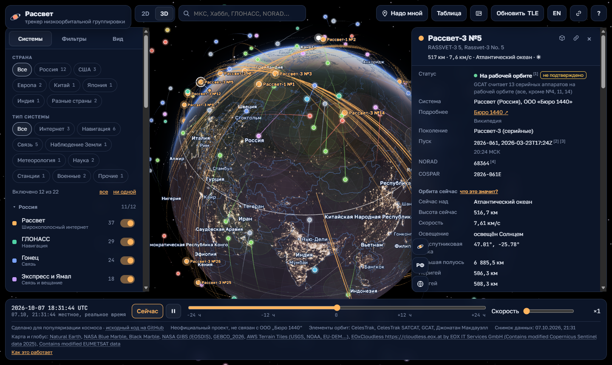
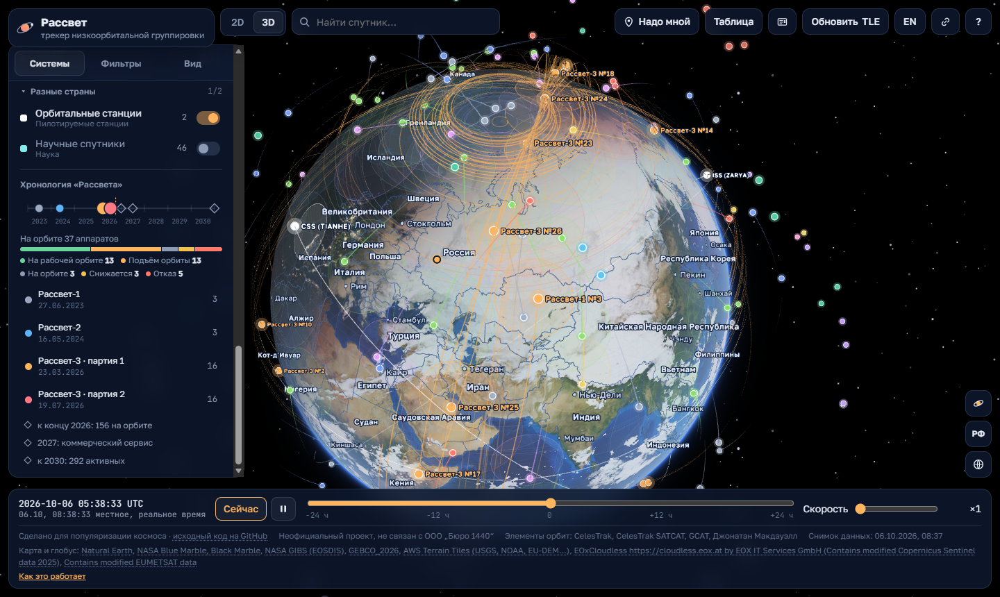
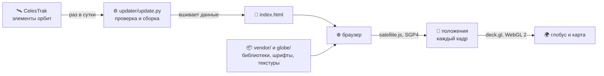

<p align="center">
  
</p>

<p align="center">
  <b>Русский</b> · <a href="README.en.md">English</a>
</p>

<p align="center">
  <a href="#-запуск-за-минуту">Запуск за минуту</a> ·
  <a href="#-как-это-устроено">Как устроено</a> ·
  <a href="#-свой-сервер-с-нуля">Свой сервер</a> ·
  <a href="#-установка-на-популярные-платформы">Платформы</a> ·
  <a href="#-что-лежит-в-репозитории">Файлы</a> ·
  <a href="#-источники-данных">Источники</a> ·
  <a href="#-вопросы-и-ответы">Вопросы</a>
</p>

---

**Рассвет · глобус спутников** — научно-популярный трекер в браузере. Фотореалистичная Земля
с ночной стороной и огнями городов, вокруг — спутники в реальном времени: российская
низкоорбитальная группировка «Рассвет» (ООО «Бюро 1440»), ГЛОНАСС, «Гонец», «Экспресс» и «Ямал»,
«Луч», «Меридиан», метеорологические и научные аппараты, спутники наблюдения Земли и Starlink.

Положения считаются прямо в браузере по модели SGP4 — никакого сервера с вычислениями, никаких
счётчиков и CDN. Снимок орбит вшит в страницу, поэтому сайт работает сразу после `git clone`.

> [!NOTE]
> Неофициальный проект, не связан с ООО «Бюро 1440». Сведения о «Рассвете» собраны из открытых
> источников, у каждого факта в карточке аппарата есть ссылка.

<p align="center">
  
</p>

<table>
  <tr>
    <td width="38%"></td>
    <td width="62%"></td>
  </tr>
  <tr>
    <td align="center"><sub>Телефон: панели складываются в шторки</sub></td>
    <td align="center"><sub>Хронология: пуски, партии и планы группировки</sub></td>
  </tr>
</table>

## 🔢 В цифрах

| | |
|---|---|
| 🛰 Систем на карте | **13** в двух группах — российские и мировые |
| 📡 Аппаратов в снимке | **≈ 11 450**, из них Starlink ≈ 11 070, «Рассвет» — 38 |
| 🌍 Карта | 242 страны, 4 583 региона, 7 342 города на русском и английском |
| 🖼 Текстуры Земли | 3 уровня детализации, до 4096 × 2048, ≈ 8 МБ |
| ⚙️ Сборка | не нужна: один HTML-файл, три библиотеки и шрифты в `vendor/` |
| 🔒 Внешние запросы страницы | **0** — всё отдаётся с вашего же сайта |

## ✨ Возможности

**Глобус и карта**
- 3D-глобус с текстурами NASA Blue Marble, рельефом GEBCO, атмосферой, облаками и ночной стороной для
  текущего момента; огни городов зажигаются по мере ухода Солнца за горизонт.
- 2D-карта в равнопромежуточной проекции, переключение одной кнопкой; вид сохраняется в ссылке.

**Спутники**
- Слои: трассы на ±½ витка, подписи без наложений, хвосты движения, зоны покрытия с настраиваемой
  минимальной высотой над горизонтом.
- Раскраска по системе, по пуску или по аппарату; у Starlink — оттенок по поколению.
- Карточка аппарата: статус (с пометкой «не подтверждено», если источники расходятся), поколение,
  пуск, NORAD и COSPAR, высота, скорость, подспутниковая точка, освещён ли Солнцем, перигей и апогей.

**Время и наблюдение**
- Шкала ±24 часа с ускорением: можно промотать и посмотреть, где спутник будет вечером.
- «Надо мной» — что сейчас выше горизонта и ближайшие пролёты «Рассветов», с пометкой, видно ли их
  глазом. Геолокация используется только в браузере и никуда не отправляется.

**Удобство**
- Таблица всех аппаратов с сортировкой, поиск по названию, NORAD или COSPAR.
- Свои TLE можно загрузить вручную — кнопка «Обновить TLE».
- Русский и английский интерфейс, подсказки «i» у каждой настройки, короткое знакомство при первом входе.
- Устанавливается на телефон как приложение (PWA) и открывается без сети с последними данными.

## 🚀 Запуск за минуту

Нужен любой статический веб-сервер. Проще всего — Python 3:

```bash
git clone https://github.com/AndrewKing228/rassvet-globe.git
cd rassvet-globe
python -m http.server 8000
```

Откройте <http://localhost:8000/>. Язык выбирается кнопкой RU/EN или параметром адреса:
<http://localhost:8000/?lang=en>.

> [!TIP]
> Открывайте страницу через сервер, а не двойным щелчком по файлу: по адресу `file://` браузер
> не даст загрузить текстуры и библиотеки.

**Браузер:** нужен WebGL 2 — подойдут Chrome, Edge, Firefox, Яндекс Браузер и Safari 15+ на компьютере
и телефоне. На слабой видеокарте страница сама переходит в облегчённый режим глобуса.

## 🔭 Как это устроено



1. **Данные.** Скрипт `updater/update.py` раз в сутки берёт у CelesTrak свежие элементы орбит,
   отбрасывает битые и устаревшие и подставляет их в блоки данных внутри `index.html`.
2. **Страница.** `index.html` — один файл: разметка, стили, код трекера и сами данные в блоках
   `<script type="application/json">`. Сервер ничего не вычисляет, он только раздаёт файлы.
3. **Расчёт.** В браузере [satellite.js](https://github.com/shashwatak/satellite-js) по модели SGP4
   переводит элементы орбит в координаты на нужный момент времени. Тысячи аппаратов считаются в фоновом
   потоке (Web Worker), а главный поток между ответами плавно продлевает их движение и только рисует.
4. **Отрисовка.** [deck.gl](https://deck.gl/) рисует глобус и карту на WebGL 2; освещение Земли,
   ночная сторона, облака и атмосфера — собственные шейдеры трекера.

## 🖥 Свой сервер с нуля

Сайт статический, так что разместить его можно где угодно — хоть на GitHub Pages. Но чтобы орбиты
обновлялись каждый день сами, нужен небольшой сервер: веб-сервер раздаёт файлы, а по таймеру раз
в сутки запускается скрипт обновления.

### Требования

| | Минимум | Комментарий |
|---|---|---|
| 💻 Сервер | 1 vCPU, **512 МБ** RAM | раздача статики почти не нагружает; скрипт обновления раз в сутки занимает до ≈ 150 МБ на 10–60 секунд |
| 💾 Диск | ≈ **200 МБ** | клон ≈ 20 МБ, виртуальное окружение Python ≈ 30 МБ, готовая страница и облака ≈ 15 МБ, журналы |
| 🐧 Система | Ubuntu 24.04 LTS или Debian 13 | подойдёт любой Linux с systemd и Python ≥ 3.10 |
| 🌐 Сеть | порты **80** и **443** открыты | исходящий HTTPS к `celestrak.org` (и к лентам новостей и карте облаков, если они включены) |
| 🏷 Домен | A/AAAA-запись на IP сервера | дальше в примерах — `example.org` |
| 🧰 Программы | `git`, `python3-venv`, `sudo`, [Caddy](https://caddyserver.com/) 2.6+ | Caddy сам получает и продлевает HTTPS-сертификат |

Ниже все команды выполняются от root (или через `sudo`). Схема каталогов:

```
/var/lib/rassvet-globe/
├── repo/    клон репозитория: шаблон страницы, библиотеки, текстуры, скрипты
├── www/     готовая страница и ежедневные данные — их пишет скрипт обновления
├── state/   кэш источников, журнал updater.log
└── venv/    виртуальное окружение Python для скрипта
```

### 1. Пакеты

```bash
apt update && apt install -y git python3-venv caddy sudo
```

<details>
<summary>В репозитории вашей системы нет пакета <code>caddy</code></summary>

Поставьте Caddy по [официальной инструкции](https://caddyserver.com/docs/install) — для Debian
и Ubuntu там есть свой apt-репозиторий.
</details>

### 2. Пользователь и код

Скрипт работает от отдельного пользователя без права входа в систему:

```bash
useradd --system --no-create-home --home-dir /var/lib/rassvet-globe --shell /usr/sbin/nologin globe
install -d -m 0755 -o globe -g globe /var/lib/rassvet-globe
cd /var/lib/rassvet-globe
sudo -u globe git clone https://github.com/AndrewKing228/rassvet-globe.git repo
sudo -u globe python3 -m venv venv
sudo -u globe venv/bin/pip install --require-hashes -r repo/updater/requirements.lock
```

`requirements.lock` закрепляет точные версии и хеши пакетов: pip откажется ставить что-то другое.

### 3. Первая сборка страницы

```bash
sudo -u globe venv/bin/python repo/updater/update.py --once \
    --template repo/index.html --static repo --out www --data state
```

В `www/` появятся `index.html`, его сжатая копия, файлы `data-starlink.<хеш>.json` и `geo-detail.<хеш>.json`
и, если включены, облака в `clouds/`. Шаблон `repo/index.html` скрипт не меняет, поэтому `git pull` потом проходит
без конфликтов.

### 4. Caddy

Замените содержимое `/etc/caddy/Caddyfile`, подставив свой домен:

```caddyfile
example.org {
	encode zstd gzip

	# служебные файлы клона наружу не отдаём
	@private path /.* /updater/* /scripts/* /docs/*
	handle @private {
		respond 404
	}

	# страница и ежедневные данные — из каталога, который пишет скрипт обновления
	@daily path / /index.html /data-starlink.* /geo-detail.* /clouds/*
	handle @daily {
		root * /var/lib/rassvet-globe/www
		file_server {
			precompressed gzip
		}
	}

	# библиотеки, текстуры и значки — прямо из клона
	handle {
		root * /var/lib/rassvet-globe/repo
		file_server
	}

	# файлы с версией или хешем в имени не меняются — пусть браузер хранит их долго
	@immutable path /vendor/* /globe/*.webp /globe/*.jpg /data-starlink.* /geo-detail.*
	header @immutable Cache-Control "public, max-age=31536000, immutable"
	@revalidate path / /index.html /sw.js /manifest.webmanifest /globe/globe.json /clouds/*
	header @revalidate Cache-Control "no-cache"
}
```

```bash
systemctl reload caddy
```

Через несколько секунд сайт откроется по `https://example.org/` — сертификат Caddy получит сам.

### 5. Ежедневное обновление

Служба, которая один раз прогоняет скрипт, — `/etc/systemd/system/rassvet-globe-update.service`:

```ini
[Unit]
Description=Rassvet globe: orbit update
Wants=network-online.target
After=network-online.target

[Service]
Type=oneshot
User=globe
WorkingDirectory=/var/lib/rassvet-globe
ExecStart=/var/lib/rassvet-globe/venv/bin/python repo/updater/update.py --once --template repo/index.html --static repo --out www --data state
NoNewPrivileges=yes
ProtectSystem=strict
ProtectHome=yes
PrivateTmp=yes
ReadWritePaths=/var/lib/rassvet-globe/www /var/lib/rassvet-globe/state
```

И таймер к ней — `/etc/systemd/system/rassvet-globe-update.timer`:

```ini
[Unit]
Description=Rassvet globe: daily orbit update

[Timer]
OnCalendar=*-*-* 03:30:00 UTC
RandomizedDelaySec=20m
Persistent=true

[Install]
WantedBy=timers.target
```

```bash
systemctl daemon-reload
systemctl enable --now rassvet-globe-update.timer
```

> [!IMPORTANT]
> CelesTrak отдаёт одну и ту же выгрузку не чаще раза в два часа, на частые запросы он отвечает
> ошибкой 403. Раз в сутки — с большим запасом. Если загрузка не удалась, скрипт берёт последнюю
> удачную копию из `state/` и оставляет сайт на прежней версии.

### 6. Проверка

```bash
systemctl list-timers rassvet-globe-update.timer
journalctl -u rassvet-globe-update.service -n 30
```

В журнале должна быть строка `Опубликовано: блоков обновлено …`. Дата снимка данных видна и в подвале
самой страницы.

### Обновление кода

```bash
cd /var/lib/rassvet-globe
sudo -u globe git -C repo pull --ff-only
sudo -u globe venv/bin/pip install --require-hashes -r repo/updater/requirements.lock
systemctl start rassvet-globe-update.service
```

### Настройки скрипта обновления

Задаются переменными окружения — в службе через строки `Environment=`:

| Переменная | По умолчанию | Что делает |
|---|---|---|
| `MAX_EPOCH_AGE_DAYS` | `30` | элементы орбит старше стольких дней считаются негодными |
| `SPACETRACK_USER`, `SPACETRACK_PASS` | — | учётная запись [Space-Track](https://www.space-track.org/) как второго источника для «Рассвета»; без неё источник пропускается |
| `UPDATE_HOUR_UTC` | `3` | час обновления в режиме `--loop` (с таймером systemd не нужен) |

Состав источников — в `updater/sources.yml`. Секции `news` (лента космических новостей из RSS) и
`clouds` (ежедневная карта облаков) необязательны: удалите их, и скрипт будет ходить только к CelesTrak.

### Без своего сервера: GitHub Pages

Сделайте форк, в настройках включите **Pages → Deploy from a branch → main / (root)** — через минуту
сайт откроется по адресу вида `https://<имя>.github.io/rassvet-globe/`. Два ограничения:

- орбиты остаются на дату снимка в репозитории — обновить их можно локально командой из следующего
  раздела и закоммитить `index.html` вместе с файлами `data-starlink.*.json` и `geo-detail.*.json`;
- сайт живёт в подпапке, а service worker и манифест рассчитаны на корень, поэтому работа без сети
  и установка на телефон будут ограничены. С собственным доменом в настройках Pages этого нет.

## 🧭 Установка на популярные платформы

| Платформа | Как ставится | Орбиты обновляются сами | HTTPS и работа без сети |
|---|---|---|---|
| 🐧 VPS с Ubuntu или Debian | [Caddy и таймер systemd](#-свой-сервер-с-нуля) | да | да |
| 🟧 Proxmox VE | лёгкий LXC-контейнер, внутри — та же инструкция | да | да, с доменом; в домашней сети — по HTTP |
| 🐳 Docker: Linux, NAS, Docker Desktop | контейнер Caddy и разовый контейнер Python | да, по cron | с доменом — да |
| 🍓 Raspberry Pi | Raspberry Pi OS — это Debian, инструкция для сервера | да | да |
| 🪟 Windows | Python или Caddy из winget | вручную | на `localhost` |
| 🍎 macOS | Python или Caddy из Homebrew | вручную | на `localhost` |
| ☁️ GitHub Pages, Netlify, Cloudflare Pages | загрузить файлы как есть | нет, снимок из репозитория | да |

### 🟧 Proxmox VE

Хватит непривилегированного LXC-контейнера — виртуальная машина не нужна. На хосте Proxmox
(веб-интерфейс → узел → **Shell**):

```bash
# свежий шаблон Debian: 13, если он есть в вашей версии Proxmox, иначе 12
pveam update
T=$(pveam available --section system | awk '/debian-1[23]-standard/ {print $2}' | sort -V | tail -1)
pveam download local "$T"

# контейнер: 1 ядро, 512 МБ памяти, 4 ГБ диска, адрес по DHCP, запуск вместе с хостом
pct create 210 "local:vztmpl/$T" \
    --hostname rassvet-globe --cores 1 --memory 512 --swap 512 \
    --rootfs local-lvm:4 --net0 name=eth0,bridge=vmbr0,ip=dhcp \
    --unprivileged 1 --features nesting=1 --onboot 1
pct start 210
pct enter 210
```

- `210` — любой свободный номер контейнера; `local-lvm` — хранилище дисков (на ZFS обычно `local-zfs`),
  `vmbr0` — сетевой мост.
- `nesting=1` нужен, чтобы внутри контейнера нормально работал systemd свежих Debian.

Внутри контейнера вы root. Дальше — шаги 1–6 из раздела [«Свой сервер с нуля»](#-свой-сервер-с-нуля).
На Debian 12 пакета `caddy` в стандартных репозиториях нет — поставьте его по ссылке из шага 1.

Как открыть сайт:
- **Из интернета, с доменом.** На роутере пробросьте порты 80 и 443 на адрес контейнера
  (`ip -4 addr show eth0` внутри него) — дальше всё как в инструкции, HTTPS Caddy получит сам.
- **Только в домашней сети.** В Caddyfile вместо `example.org` напишите `:80` — сайт откроется по
  `http://<адрес контейнера>/`. Глобус и карта работают полностью, но без HTTPS браузер не включит
  service worker: не будет работы без сети и установки на телефон.

### 🐳 Docker

Подойдёт Linux-сервер, NAS с поддержкой Docker или Docker Desktop. На Windows команды ниже
выполняйте в терминале WSL.

```bash
mkdir rassvet-globe && cd rassvet-globe
git clone https://github.com/AndrewKing228/rassvet-globe.git repo
mkdir www state
```

Рядом создайте `Caddyfile` — та же раздача из двух каталогов, что и на сервере:

```caddyfile
:80 {
	encode zstd gzip

	@private path /.* /updater/* /scripts/* /docs/*
	handle @private {
		respond 404
	}

	@daily path / /index.html /data-starlink.* /geo-detail.* /clouds/*
	handle @daily {
		root * /srv/www
		file_server {
			precompressed gzip
		}
	}

	handle {
		root * /srv/repo
		file_server
	}
}
```

Скрипт обновления — в файл `update.sh`; он каждый раз запускает чистый контейнер Python:

```bash
cat > update.sh <<'SH'
#!/bin/sh
cd "$(dirname "$0")"
docker run --rm -v "$PWD/repo:/repo:ro" -v "$PWD/www:/www" -v "$PWD/state:/state" python:3.12-slim \
    sh -c "pip install -q --root-user-action=ignore --require-hashes -r /repo/updater/requirements.lock \
           && python /repo/updater/update.py --once --template /repo/index.html --static /repo --out /www --data /state"
SH
chmod +x update.sh && ./update.sh
```

Запуск сайта:

```bash
docker run -d --name rassvet-globe --restart unless-stopped -p 8080:80 \
    -v "$PWD/Caddyfile:/etc/caddy/Caddyfile:ro" \
    -v "$PWD/repo:/srv/repo:ro" -v "$PWD/www:/srv/www:ro" \
    caddy:2
```

Сайт откроется на <http://localhost:8080/>. Чтобы орбиты обновлялись каждый день, добавьте в
`crontab -e` строку с полным путём к папке:

```
30 3 * * * /полный/путь/rassvet-globe/update.sh >/dev/null 2>&1
```

> [!TIP]
> Для HTTPS с доменом замените в Caddyfile `:80` на `example.org`, а в `docker run` — `-p 8080:80` на
> `-p 80:80 -p 443:443 -v caddy_data:/data`: в томе `caddy_data` Caddy хранит полученный сертификат.

### 🍓 Raspberry Pi

Подойдут Raspberry Pi 3, 4, 5 и Zero 2 W с 64-битной Raspberry Pi OS. Это Debian, поэтому дальше —
раздел [«Свой сервер с нуля»](#-свой-сервер-с-нуля): Caddy ставится по ссылке из шага 1, а для sgp4
и PyYAML есть готовые сборки под ARM64, компилятор не нужен. Сам глобус удобнее открывать с компьютера
или телефона: браузеру на Pi может не хватить видеокарты.

### 🪟 Windows

Посмотреть локально: поставьте Git и Python — `winget install Git.Git`, затем
`winget install Python.Python.3.12` — и в новом окне PowerShell:

```powershell
git clone https://github.com/AndrewKing228/rassvet-globe.git
cd rassvet-globe
py -m http.server 8000
```

Вместо Python можно взять Caddy: `winget install CaddyServer.Caddy`, затем в папке репозитория
`caddy file-server --listen :8000`.

Обновить орбиты:

```powershell
py -m venv .venv
.venv\Scripts\pip install --require-hashes -r updater\requirements.lock
.venv\Scripts\python updater\update.py --once --template index.html --static . --out . --data .cache
```

Для постоянного сайта на Windows удобнее [Docker](#-docker) через Docker Desktop или WSL с Ubuntu
и инструкцией для сервера.

### 🍎 macOS

С [Homebrew](https://brew.sh/):

```bash
brew install git python caddy
git clone https://github.com/AndrewKing228/rassvet-globe.git
cd rassvet-globe
python3 -m http.server 8000          # или: caddy file-server --listen :8000
```

Орбиты обновляются командами из раздела [«Обновить орбиты локально»](#-обновить-орбиты-локально)
(с `python3` вместо `python`).

### ☁️ Статические хостинги

Сайт работает на любом хостинге статики без сборки. Орбиты при этом остаются на дату снимка в
репозитории — обновляйте их локально и выкладывайте заново.

- **GitHub Pages** — см. [выше](#без-своего-сервера-github-pages).
- **Netlify** — ручная публикация (*Deploy manually*): перетащите в окно папку репозитория без `.git`.
- **Cloudflare Pages** — проект с загрузкой файлов (*Upload assets*), та же папка. Самый крупный файл,
  `index.html`, весит ≈ 4,8 МБ — в лимит 25 МБ на файл укладывается.

## 🔄 Обновить орбиты локально

```bash
python -m venv .venv
.venv/bin/pip install --require-hashes -r updater/requirements.lock      # Windows: .venv\Scripts\pip
.venv/bin/python updater/update.py --once --template index.html --static . --out . --data .cache
```

Так страница обновляется на месте: `index.html` переписывается, блоки Starlink и регионов с городами уходят
в файлы `data-starlink.<хеш>.json` и `geo-detail.<хеш>.json` рядом, кэш и журнал — в `.cache/`. Чтобы сначала посмотреть результат,
замените `--once` на `--dry-run`: собранная страница окажется в `.cache/state/dry-run/`, а рабочие
файлы не изменятся.

> [!NOTE]
> Повторно обновлять на месте лучше от чистого файла: `git checkout -- index.html`, затем команда
> выше. Иначе скрипт возьмёт за шаблон уже обновлённую страницу.

## 🎨 Пересобрать текстуры глобуса

Готовые текстуры уже лежат в `globe/`, пересобирать их нужно, только если вы меняете источники
или кодирование. Понадобятся ≈ 5 ГБ места (исходники качаются с докачкой) и утилита `cwebp`
(пакет `webp`):

```bash
.venv/bin/pip install --require-hashes -r scripts/globe/requirements.lock
.venv/bin/python scripts/globe/build_globe.py --src .cache/globe-src --out globe
```

## 📂 Что лежит в репозитории

```
rassvet-globe/
├── index.html                ← вся страница: код, стили и вшитые данные
├── sw.js                     ← работа без сети
├── manifest.webmanifest      ← установка на телефон
├── earth-day.jpg             ← Земля днём для 2D-карты
├── earth-night.jpg           ← огни городов для 2D-карты
├── favicon.ico, apple-touch-icon.png, icon-*.png
├── globe/                    ← текстуры 3D-глобуса и их манифест
├── vendor/                   ← deck.gl, satellite.js, topojson-client, шрифты
├── updater/                  ← скрипт ежедневного обновления орбит
├── scripts/globe/            ← сборка текстур глобуса из исходников
└── docs/                     ← баннер и скриншоты для этого README
```

### 📄 Страница

**`index.html`** (≈ 4,8 МБ) — это и есть приложение. Код занимает ≈ 270 КБ и ≈ 3 400 строк:
интерфейс, расчёт положений, слои deck.gl, шейдеры Земли и атмосферы, переводы на два языка.
Остальные ≈ 4,5 МБ — данные в 19 блоках `<script type="application/json">`:

| Блок | Что внутри |
|---|---|
| `registry` | реестр 13 систем: названия, цвета, группа, правила, по которым аппарат из общего каталога попадает в систему |
| `data-rassvet` | всё о «Рассвете»: 38 аппаратов с элементами орбит, 3 поколения, 4 пуска, планы до 2030 года и 34 источника — у каждого факта статус «подтверждено» или «не подтверждено» |
| `data-glonass` … `data-ru-other` | 11 российских систем, по строке на аппарат: NORAD, название, COSPAR, дата пуска, программа и категория по GCAT, подтип, перигей, апогей и наклонение по SATCAT, элементы орбиты и их эпоха |
| `data-starlink` | ≈ 11 070 аппаратов Starlink (≈ 2,7 МБ) — догружается после первого кадра, чтобы страница открывалась быстро |
| `geo-data` | Natural Earth (≈ 360 КБ): 242 страны — берега, границы и подписи, нужные для первого кадра |
| `geo-detail` | Natural Earth (≈ 1,3 МБ): границы регионов, 4 583 региона и 7 342 города с подписями на русском и английском — подгружаются после первого кадра |
| `data-meta` | дата снимка и список источников, из которых он собран |
| `data-history`, `data-news` | история высоты орбит и лента новостей — заполняет скрипт обновления |

**`sw.js`** — service worker. Страницу берёт сначала из сети, а без сети — из сохранённой копии.
Библиотеки, текстуры и файлы данных с хешем в имени хранит в кэше навсегда (они не меняются),
тайлы ближнего вида — не больше 600 штук. При смене стратегии кэша в файле поднимается номер версии,
и старые кэши удаляются сами.

**`manifest.webmanifest`** и значки — описание приложения для установки на главный экран: название,
цвета, значки 192 и 512 пикселей, включая «маскируемый» для Android.

**`earth-day.jpg`, `earth-night.jpg`** — плоские текстуры NASA для 2D-карты: дневная Земля как
подложка и огни городов, которые проступают на ночной стороне.

### 🌍 Текстуры глобуса — `globe/`

Каждая текстура есть в трёх размерах: 1024, 2048 и 4096 пикселей по ширине. Страница начинает с
малого и подгружает крупный, если позволяет видеокарта. В именах файлов — хеш содержимого,
поэтому браузер может хранить их вечно.

| Файлы | Что это |
|---|---|
| `color-*.webp` | цвет Земли — NASA Blue Marble: Next Generation, июль 2004 |
| `relief-*.webp` | без потерь: в каналах R и G — наклоны рельефа по GEBCO_2026 (из них шейдер строит светотень гор и шельфа), в канале B — доля воды по Natural Earth (блик Солнца на океане) |
| `night-*.webp` | яркость ночных огней — NASA Black Marble 2016 |
| `clouds-*.jpg` | облака NASA — запасные, если нет ежедневной карты облаков |
| `globe.json` | манифест: какие файлы на каком уровне, пороги облачности, подстройка цвета, адреса и SHA-256 исходников, атрибуция |

### 📦 Библиотеки — `vendor/`

Копии файлов из npm без изменений, рядом — тексты лицензий. Версия в имени папки, поэтому
обновление библиотеки — это новая папка, а не правка старой.

| Папка | Размер | Зачем |
|---|---|---|
| `deck.gl@9.4.0/` | 2,0 МБ | отрисовка на WebGL 2: глобус с наклоном камеры, карта, слои точек, линий, подписей, рельефа |
| `satellite.js@6.0.2/` | 24 КБ | SGP4/SDP4: из элементов орбиты — координаты спутника на любой момент |
| `topojson-client@3.1.0/` | 8 КБ | распаковка границ стран из компактного формата TopoJSON |
| `fonts-5.3.0/` | 284 КБ | Golos Text для интерфейса и JetBrains Mono для чисел; 30 файлов woff2 — только нужные начертания и алфавиты |

### ⚙️ Скрипты

**`updater/update.py`** (≈ 900 строк) — ежедневное обновление данных:
- скачивает выгрузки из `sources.yml`, при сбое повторяет с паузами 5, 15 и 45 секунд;
- проверяет каждую запись: контрольные суммы TLE, разбор моделью SGP4, возраст эпохи; если битых
  записей больше 5 %, вся выгрузка отбрасывается;
- для каждого аппарата берёт запись с самой свежей эпохой из всех источников;
- обновляет только блоки данных, разметку и код страницы не трогает, и сверяет результат с шаблоном;
- публикует атомарно: посетитель видит либо старую страницу, либо новую целиком;
- режимы `--once`, `--dry-run` и `--loop` (постоянная работа с обновлением раз в сутки).

**`updater/sources.yml`** — откуда брать данные: CelesTrak (`NAME=RASSVET` в TLE и `GROUP=active`
в OMM JSON), по желанию Space-Track, четыре RSS-ленты новостей и карта облаков. Комментарии в файле
объясняют каждое поле.

**`scripts/globe/build_globe.py`** — сборка `globe/` из исходников NASA, GEBCO и Natural Earth:
скачивание с докачкой и проверкой размера, уменьшение, расчёт наклонов рельефа, маска воды,
кодирование в WebP и запись манифеста.

**`requirements.txt` и `requirements.lock`** рядом с каждым скриптом: первый — что нужно,
второй — точные версии с хешами для `pip install --require-hashes`.

### 📑 Документы

| Файл | О чём |
|---|---|
| `README.md`, `README.en.md` | это описание на русском и английском |
| `THIRD_PARTY_NOTICES.md` | версии, лицензии и атрибуция всего стороннего: библиотек, шрифтов, снимков, данных |
| `LICENSE` | лицензия MIT на код и документацию проекта |

## 📚 Источники данных

| Что | Откуда | Лицензия |
|---|---|---|
| Элементы орбит, каталог SATCAT | [CelesTrak](https://celestrak.org/) | открытые данные |
| Классификация аппаратов | [GCAT](https://planet4589.org/space/gcat/), Джонатан Макдауэлл | CC BY 4.0 |
| Сведения о «Рассвете» | открытые источники, ссылки в карточке каждого аппарата | — |
| Границы, регионы, города | [Natural Earth](https://www.naturalearthdata.com/) | общественное достояние |
| Цвет Земли, огни, облака | NASA Blue Marble, Black Marble | общественное достояние |
| Рельеф | [GEBCO_2026](https://doi.org/10.5285/4f68d5c7-45eb-f999-e063-7086abc036fa) | общественное достояние, с указанием источника |

Подробности и полные тексты лицензий — в [THIRD_PARTY_NOTICES.md](THIRD_PARTY_NOTICES.md).

## ❓ Вопросы и ответы

<details>
<summary><b>Насколько точны положения спутников?</b></summary>

SGP4 по свежим элементам даёт ошибку порядка километра. С каждым днём после эпохи элементов ошибка
растёт, а после манёвра спутника старые элементы и вовсе неверны. Поэтому данные обновляются
ежедневно, а аппараты со старыми элементами страница помечает баннером.
</details>

<details>
<summary><b>Почему при сильном приближении картинка размытая?</b></summary>

Детальный рельеф и снимки вблизи страница берёт из тайлов по адресам `tiles/dem/…`, `tiles/img/…`
и `tiles/night/…` того же сайта. В репозитории их нет, поэтому вблизи глобус остаётся на общих
текстурах 4096 × 2048. Ссылки на источники тайлов в подвале страницы относятся только к этому режиму.
</details>

<details>
<summary><b>Работает ли сайт без интернета?</b></summary>

Да, после первого открытия по HTTPS или на `localhost`: service worker сохраняет страницу,
библиотеки и текстуры. Положения спутников всё равно считаются по последним сохранённым данным.
</details>

<details>
<summary><b>Куда сайт отправляет данные о посетителе?</b></summary>

Никуда. Нет счётчиков, рекламы, шрифтов и библиотек со сторонних сайтов. Геолокация для блока
«Надо мной» запрашивается только по нажатию кнопки и хранится только в браузере — её можно
сбросить кнопкой «изменить».
</details>

<details>
<summary><b>Можно ли поставить сайт в подпапку, например <code>/globe/</code>?</b></summary>

Страница и библиотеки работают по относительным путям, так что откроются. Но service worker и
манифест рассчитаны на корень сайта — работа без сети и установка на телефон в подпапке будут
ограничены.
</details>

## 📄 Лицензия

Код и документация — [MIT](LICENSE). Сторонние библиотеки, шрифты, снимки и данные распространяются
по своим лицензиям, см. [THIRD_PARTY_NOTICES.md](THIRD_PARTY_NOTICES.md).
